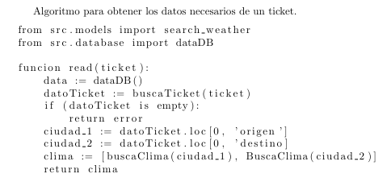
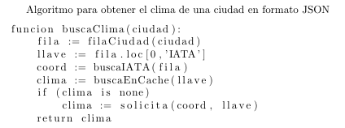
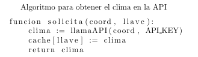
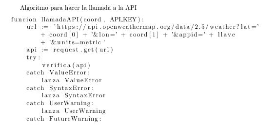
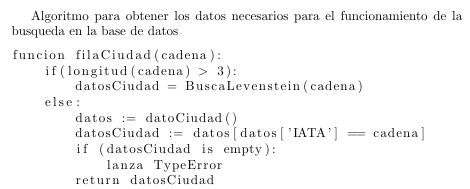
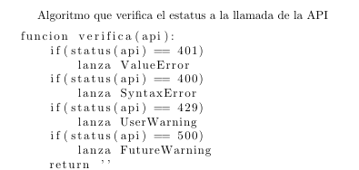
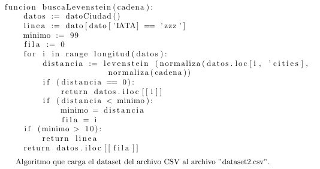

# Capy Weather

## Proposito
Se deberá entregar una aplicación gráfica la cual acepte como entrada, un ticket o el nombre
de la ciudad a la cual se esta interesado en conocer el clima. La entrada debe ser capaz de aceptar
errores, por ejemplo: Monterye, Montery, Monterey y MTY, cada uno de estos deberá contestar
con el clima de Monterey.

## Dependencias nesesarias
* Python (3.8 o superior)
* Pandas
* Flask
* requests

>:warning:
>la instalacion de librerias y como correr el programa estaran al fondo del Readme

### Desarrollo:
La primer problematica a enfretarnos seria la de saber como conseguir la informacion del clima de una ciudad dada, para esto se utilizo los servicios de OpenWeather[^1], esta es una empresa que pone a nuestra disposicion una API a la cual llamas con unas coordenadas y una llave, esta devuelve el clima de las coordenadas proporcionadas.
>:key:
> nesesitas una API key valida proporcionada por OpenWeather, en su pagina estan las instrucciones para conseguirla, por motivos obvios no la podemos proporsionar nosotros.

Ya que se posee la una forma de acceder al clima de cualquier parte del mundo, se tendra que ver como es que se obtienen los datos, para esto se nos proporciono un dataset(en formato csv), de la cual sacar los tickets y las coordenadas de las ciudades, asi pues ya tenemos la base de datos. Sin embargo, como el programa puede recibir el IATA code de un aeropuerto, y ademas el nombre de la ciudad donde se encuentra, se contara con un dataset independiente en el que se almacena el IATA code, el nombre de la ciudad y las coordenadas de la misma (tambien en formato csv).

Como contamos con archivos csv en los cuales tenemos almacenada la informacion, una forma de poder leerlos y hacer busquedas en el de forma relativamente simple, sera utilizando la libreria de pandas, esta nos permite leer datasets en diversos formatos y manipularlos de forma sencilla
para su implementacion basta con leer la documentacion [^2]. Asi pues, ya es posible leer los datasets proporcionados y resactar de ellos la informacion que nesitamos.

Ahora bien, ya tenemos como conseguir las coordenadas nesesarias para el clima, es nesesario buscar con una forma de llamar a la API con los datos correspondentes para conseguir la información que se requeire. para lograr esto de una forma en la que sea sencillo capturar posibles errores a la hora de hacer la peticion, y que ademas nos de la informacion en un formato facil de manipular, se decidio por usar la libreria de requests[^3], ya que esta solo requiere como argumento una url y a partir del objeto instanciado es facil verificar el estatus que mando el servidor de la API y recuperar la informacion que este regresa en formato json es muy facil.

Como se sigue el patron de diselño MVC (Modelo Vista Controlador) y ya tenemos toda la parte del modelo cubierta, es nesesario determinar con que se realizara la parte de vista (ya que esto determina como se hara el controlador que comunicara ambas partes), asi pues basado en facilidad de uso y practicidad, se opto por utilizar flask[^4], el cual facilita la creacion de la interfaz grafica, asi pues, el programa sera una aplicacion web.

Con el framework de Flask, se pudo crear plantillas de html de manera eficiente y de cierta manera con una mejor estructurada, facilitar la comunicación entre la parte visual y el controlador, favorecer la colaboración en el proyecto y propocionar una estructura al proyecto. El framework posibilito la entrada y salida de datos desde las plantillas html, con apoyo de las librerias importadas de request y render_template, se logro acceder a los a los datos que se introducen mediante la bara de navegacion de la plantilla index.html, como en la bara de navegación pueden ingresar cualquier dato, se requiere comparar si el tamaño del dato para poder determinar si es ticket o ciudad o IATA code. 

Después del proceso de datos y la obtencion de informacion de la api OpenWeather[^1], dependiendo de la busqueda los resultados se van a presentar de manera amigable en las plantillas result_city.html o result_ticket.html.

Para poder hacer las diferentes plantillas de html, se ocupo componentes del framework de Bootstrap[^5], como la barra de navegación y la carta que se despliega tanto en las plantillas html de los errores y los resultados, además de usar grid[^6] para el acomodamiento de los datos en las plantillas de los resulatdos.


### Resolucion de problema
Lo primero a tratar seria como es que funcionaria la app por el lado del modelo, para esto se diseñaron los siguientes pseudocodigos:















en estos se puede observar a detalle que es lo que hacen los algoritmos del programa, claro esta que en la documentacion del propio codigo se dan mas detalles acerca de cada uno.

## Codigo de otras fuentes
en el proyecto hicimos uso de codigo externo, especificamnete tomamos la implementacion del algoritmo de Levenshtein que se encuentra dsiponible en wikipedia[^7], esto fue hecho asi porque es una version mas eficiente de la que nosotros podriamos hacer y ademas como tal solo calcula la distancia de Levenshtein de 2 strings, la implentacion de este algoritmo para que nos ayudara a buscar coincidencias fue totalmente original.
el codigo en cuestion es la funcion [`levenstein()`](src/models/levenstein.py)

## Como instalar y correr el programa
>:warning:
> se estas instruciones estan garantizadas que funcionan para Python 3.8 en adelante, ademas presupone que tienes pip instalado(cualquier version de Python igual o superior a la 3.8 lo tiene preinstalado) si no se tiene pip instalado se debera instalar en su equipo

lo primero que se tiene que hacer es clonar el repositorio, para esto pegaremos el siguiente comando en la terminal:
```
git clone https://github.com/RaulLabonne/Proyecto-1.git
```
ya que hemos clonado el repositorio nos situaremos justo el la carpeta del repositorio, ahi se correra el siguiente comando dependiendo de que sistema operativo tengamos.

### Instalar y ejecutar en windows
ya en la carpeta de la app, correremos el siguiente comando:
```
.\src\resource\install.ps1
```
tambien lo puedes ejecutar desde el explorador de archivos haciendo doble click en `.../Proyecto-1/src/resource/install.ps1`, esto creara el entorno virtual en donde se correra el programa y ademas instalara todas las librerias nesesarias.

ya hecho esto, para ejecutar el programa solo basta ejecutar el siguiente comando en la terminal:
```
.\src\resource\execute.ps1
```
esto activara el entorno virtual (en caso de que se desactive) y ejecutara el programa.

### Instalar y ejecutar en linux y MacOs
ya en la carpeta de la app, correremos el siguiente comando:
```
bash src/resource/install.sh
```
esto creara el entorno virtual en donde se correra el programa y ademas instalara todas las librerias nesesarias.

ya hecho esto, para ejecutar el programa solo basta ejecutar el siguiente comando en la terminal:
```
bash src/resource/execute.sh
```
esto activara el entorno virtual (en caso de que se desactive) y ejecutara el programa.

ya con el programa corriendo, pegaremos en el navegador la siguiente direccion:
```
http://127.0.0.1:5000
```
y en esa pagina podremos usar el programa. Para desactivarlo basta con oprimir `Ctrl+C` en la terminal

## Fuentes de consulta

[^1]: https://openweathermap.org
[^2]: https://pandas.pydata.org
[^3]: https://pypi.org/project/requests/
[^4]: https://flask.palletsprojects.com/en/2.3.x/
[^5]: https://getbootstrap.com/
[^6]: https://getbootstrap.com/docs/5.3/layout/grid/
[^7]: Distancia de Levenshtein. (2023, 7 de enero). Wikipedia, La enciclopedia libre. desde https://es.wikipedia.org/w/index.php?title=Distancia_de_Levenshtein&oldid=148447096.
